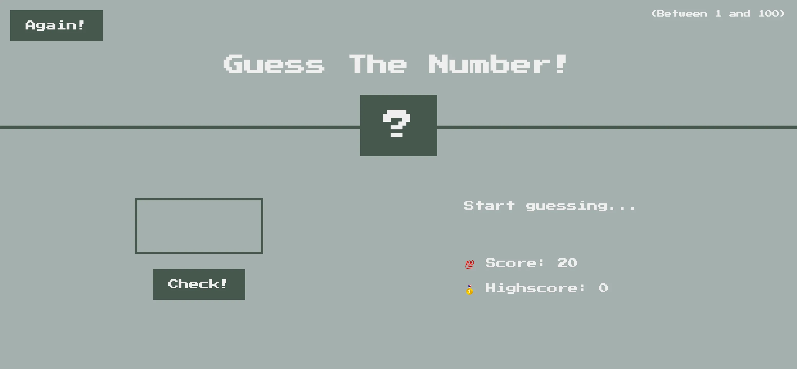
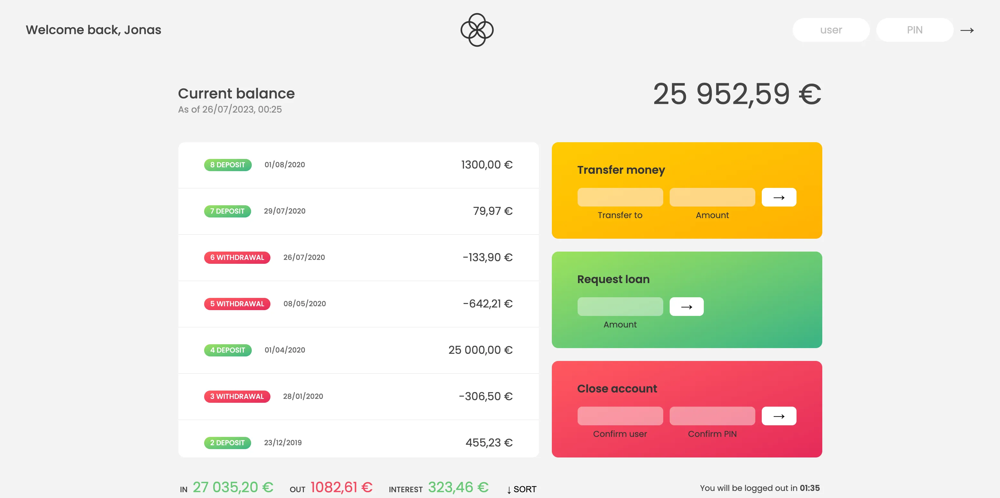

#  JavaScript
This repository is for the different JS projects I will be building as I learn the programming language.  
**❗️NOTE:** Most of the projects in this repository is not mine (meaning I didn't design it. The HTML and CSS). The projects are from the Udemy course by  *__Jonas Schmedtmann__* JavaScript course. However, the table below lists the projects and it author.  

The most projects are not responsive. So, I advise to view the projects on a laptop or desktop. You can access the Project portal from here -> _[JS Projects | Samuel's JS projects](https://koigor97.github.io/JS/)_

___

##### List of Projects, their difficulty level, and the Author.
|      Project      | Difficulty Level | Completed | Author | Responsive |
|:-----------------:|:----------------:|:---------:|:-------:|:------------:|
|   G‍uess The Number❓    |     Beginner     |     ✅     | Jonas Schmedtmann | ✅ |
|  Bankist-Minimalist Banking 💸  |   Intermediate   |     ✅     | Jonas Schmedtmann | ❌ |
|   Bankist landing page 💸 |   Intermediate   |     ✅     | Jonas Schmedtmann | ❌ |
|                   |                  |           |

___

## Guess The Number ❓
The Guess The Number game is an introduction to D.O.M manipulation. How JS interacts with the D.O.M tree created by the Web Browser. It also solidify my understanding of the JavaScripts different data structures, conditional statements, logical operators etc.

___

## Bankist (Minimalist Banking) 💸
Bankist project introduces me to more advanced way of data manipulations as well as manipulating the DOM. Introduces me to ES6 features and writing modern JavaScript. Going in depth on working with Arrays, Objects, Maps, Sets, and their different methods. How to use the _"this.keyword_,  _call_, _apply_, _bind"_ method function methods. First class and Higher Order function etc.
The _users_ and _login PINs_ are - **1. js - 1111**, **2. jd - 2222**. 

### [How JavaScript works behind the scene]:
There was a section dedicated explaning and demystifying how JS works behind the scene. This involve the Call Stack, the Heap, Excution Context, Global Excution environment, Scoping etc.

___
## Bankist Landing Page 💸
The Bankist landing pages dive deep into advance DOM manipulations. Explaining how the DOM API works. That every Node contains an Element node, Text node, Comment node, and Document node, with Element node also have its own HTML elements node. This is made possible because of **Inheritance**. The Event Target which crowns over the all makes it possible for us to call or listen for event on every node in the DOM tree. Other core DOM concepts taught and applied in the project was Bubbling and Capturing. Looking also at HTML5 feature like the **Defer** and **Async** script loading.

