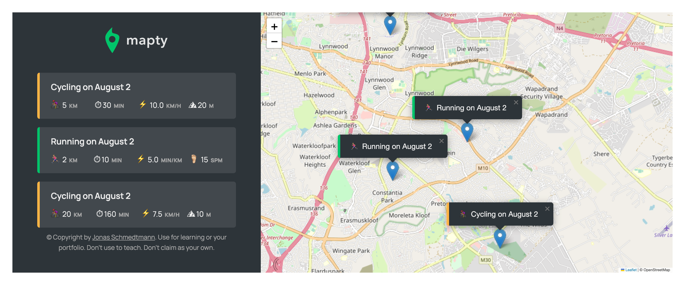

#  JavaScript

This repository is for the different JS projects I will be building as I learn the programming language.  
**❗️NOTE:** Most of the projects in this repository is not mine (meaning I didn't design it. The HTML and CSS). The projects are from the Udemy course by  ***Jonas Schmedtmann*** JavaScript course. However, the table below lists the projects and it author.  

The most projects are not responsive. So, I advise to view the projects on a laptop or desktop. You can access the Project portal from here -> *[JS Projects | Samuel's JS projects](https://koigor97.github.io/JS/)*

___

##### List of Projects, their difficulty level, and the Author

|      Project      | Difficulty Level | Completed | Author | Responsive |
|:-----------------:|:----------------:|:---------:|:-------:|:------------:|
|   G‍uess The Number❓    |     Beginner     |     ✅     | Jonas Schmedtmann | ✅ |
|  Bankist-Minimalist Banking 💸  |   Intermediate   |     ✅     | Jonas Schmedtmann | ❗️ |
|   Bankist landing page 💸 |   Intermediate   |     ✅     | Jonas Schmedtmann | ❌ |
| Mapty  | Intermediate | ✅ | Jonas Schmedtmann | ❌ |
|                   |                  |           |

___

## Guess The Number ❓

The Guess The Number game is an introduction to D.O.M manipulation. How JS interacts with the D.O.M tree created by the Web Browser. It also solidify my understanding of the JavaScripts different data structures, conditional statements, logical operators etc.


___

## Bankist (Minimalist Banking) 💸

Bankist project introduces me to more advanced way of data manipulations as well as manipulating the DOM. Introduces me to ES6 features and writing modern JavaScript. Going in depth on working with Arrays, Objects, Maps, Sets, and their different methods. How to use the *"this.keyword*,  *call*, *apply*, *bind"* function methods. Array methods like *pop*, *shift*, *push*, *unshift*, *indexOf*, *lastIndexOf*, *for of loop*, *forEach loop*, *splice*, *slice*, *trim*, *flat*, *flatMap*, *sort, filter, reduce, map etc* First class and Higher Order function etc.
The *users* and *login PINs* are - **1. js - 1111**, **2. jd - 2222**.


### [How JavaScript works behind the scene]

There was a section dedicated explaning and demystifying how JS works behind the scene. This involve the Call Stack, the Heap, Excution Context, Global Excution environment, Scoping etc.

___

## Bankist Landing Page 💸

The Bankist landing pages dive deep into advance DOM manipulations. Explaining how the DOM API works. That every Node contains an Element node, Text node, Comment node, and Document node, with Element node also have its own HTML elements node. This is made possible because of **Inheritance**. The Event Target which crowns over the all makes it possible for us to call or listen for event on every node in the DOM tree. Other core DOM concepts taught and applied in the project was Bubbling and Capturing. Looking also at HTML5 feature like the **Defer** and **Async** script loading.


___

## OOP in JavaScript :man_shrugging:

 ```js
    const isOopInJsWierd = true;

    if (isOopInJsWierd) console.log('JavaScript Object Oriented Programming is wierd 😄');
 ```

 OOP in Python for me is direct. You create a new file, name it what as to it purpose, write **<span style="color:#3b82f6">CLASS</span>** keyword and name the class. If you want to use one of the pillars of OOP like __INHERITANCE__, you import the class from the module and pass it in your own class as a parameter like this:

```python
 class UserDashboard(tkinter):
   def __init__(self, param):
      super().__init__()
```

 However, I have come to know that JavaScript do it differently. In JS, the word is **<span style="color:#0ea5e9">PROTOTYPE</span>**. Any Object instantiated that is link to a certain prototype inherits the properties and methods found in the prototype. And yes, it not like the regular Inheritance, but rather, it is called Prototypal Inheritance 😀. To make it more fun, there 3 ways to implement OOP in JS: **<span style="color:#0ea5e9">Constructor Functions</span>**(which actually not a feature of JavaScript, but rather a pattern implemented by prgrammers), **<span style="color:#0ea5e9">ES6 Classes</span>**(which rather a fancy version of constructor function that use the <span style="color:#0ea5e9">Class</span> keyword for programmers who are use to traditional way of creating classes), **<span style="color:#0ea5e9">Object.create()</span>**. It can get be a challenge to understand but I feel like you stand better chance to comprehend the concept when you really understand the Prototype Chain. I will explain the using the Constructor Function.  

### **<span style="color:#3b82f6">Constructor Function:</span>**

```js
const ElectroCar = function(type, doors, seats) {
   this.type = type,
   this.doors = doors,
   this.seats = seats
   this.__proto__ = ElectroCar.Prototype
}

// Note: construct a prototype using () => function.
// 4 steps to happens behind the scene when you constructor a prototype:
// 1. An empty Object {} is created,
// 2. the empty Object is assigned to the 'this' keyword: this = {}
// 3. the __proto__ property is linked to constructor prototype.
// 4. and finally the Object is return.

const car = new ElectroCar('SUV', 2, 2);

// lets say you want to give it a method/behavior. The reason why you can declare a method in the constructor function
// is for runtime speed. Meaning your program will run slow if you have like 1000 Objects. That is where Prototype come into play.

ElecctroCar.prototype.drive = function () {
   console.log(`Let's roll....Vroooom💨`);
}
```

The bottom code is where it gets confusing. The 'drive' method is not a prototype of the **<span style="color:#84cc16">ElectroCar</span>** but rather is a prototype of **<span style="color:#3b82f6">car</span>**. Remeber what happens behind the scenes, an Object is returned, and so, that function becomes an Object which is assign as a value of the instance of **<span style="color:#3b82f6">car</span>**. I know I am confusing you even more. I am still working on my teaching skills 😀. But, this link will help you out (https://developer.mozilla.org/en-US/docs/Web/JavaScript/Inheritance_and_the_prototype_chain). Just know that all object have prototype and even the **<span style="color:#84cc16">ElectroCar</span>** has a prototype that chained upwards to the **<span style="color:#0ea5e9">Object.prototype</span>** from the built in construction function for **<span style="color:#0ea5e9">Object</span>**. Yup, it official, I suck at teaching 😀. Please forgive if any of this to make sense to you. There is a whole lot more of how JS implement OOP with using the four pillars of OOP. You can do your own research and also;

```js
console.log(Object.prototype) or copy the code above and console.log(car.__proto__) and then on the next line console.log(car.__proto__.__proto__); and dig through the output.

```
I will stop talking now JS OOP 🤐.

### **<span style="color:#3b82f6">ES6 Classes</span>**(the modern way):

```js
class Person {
    constructor(fullname, age, job) {
        this.fullname = fullname,
            this.age = age,
            this.job = job;
    }
    // prototypes
    intro() {
        console.log(`My name is ${this.fullname}, I am ${this.age}, and I am currently ${this.job}`);
    }
}

const person = new Person('Samuel Turay', 25, 'Unemployed');
person.intro() // My name is Samuel Turay, I am 25, and I am currently Unemployed
```

### **<span style="color:#3b82f6">Object.Create</span>**

```js
const UserAge = {
    calculateAge() {
        console.log(`You are ${2023 - this.birthYear} years old ${this.firstName}`);
    },

    userInfo(firstName, birthYear) {
        this.firstName = firstName,
        this.birthYear = birthYear
    }
}

const sarah = Object.create(UserAge);
sarah.userInfo('Sarah', 2002);
sarah.calculateAge()

// result -> You are 21 years old Sarah
```

___

### **<span style="color:FD8D14">Note:</span>**

* #### Classes are just "syntactic sugar" over Constructor functions

* #### Classes are NOT hoisted.

* #### Classes are first-class citizens

* #### Classes are excuted in strict mode

___

## Mapty // Map your workouts  

This Mapty app project is by far the best project I have done. It allows you to think like a programmer rather than just writing code. You think about the project from the perspective of the user. What the user wants to achieve with the app, what features are going to make them achieve thier goal. You then think about the architecture of the code. Are there how many classes do you need, methods, logics, any third party API or package, a flowchart. All of these brings to perspective, how you as the developer is going to start and complete the project. The Mapty project made use of ES6 Classes, the Navigator and Local storage APIs. The Leaflet JavaScript Open-source library. In summary, it was a fun project and I learned alot.  
```Note```: You must click on the map logging a activity.



